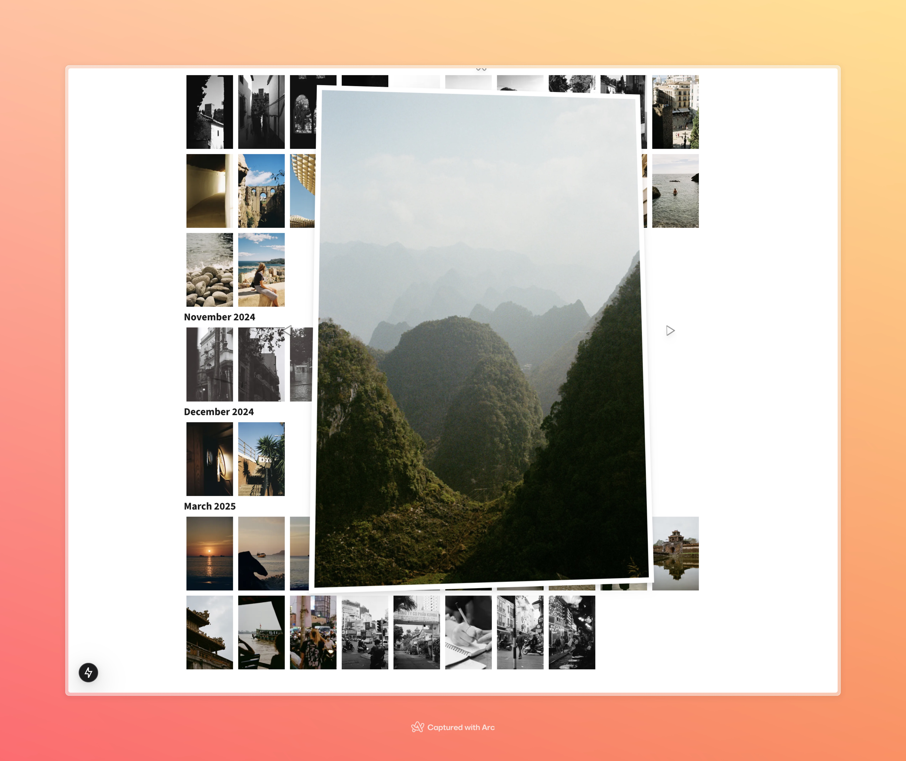

# 3D card-like Lightbox and PhotoGrid for Next.js and Tailwind

Basic component that shows a photo grid for an array of photo libraries, and for each photo produces a lightbox that reacts to the user's mouse and emulates a 3D effect.

Example in use on [jakecrouchley.com/photography](http://jakecrouchley.com/photography).



## Example Usage:

```typescript
import PhotoGrid, { PhotoLibrary } from "./PhotoGrid";

export default function ExampleUsage() {
  // src: should be the path to an image in the Next.js /public folder
  const photoLibraries: PhotoLibrary[] = [
    {
      title: "Collection 1",
      photos: [{ src: "/images/photo1.jpg", alt: "photo 1" }],
    },
    {
      title: "Collection 2",
      photos: [
        { src: "/images/photo2.jpg", alt: "photo 2" },
        { src: "/images/photo3.jpg", alt: "photo 3" },
      ],
    },
  ];

  return (
    <>
      <h1>My Images</h1>
      {photoLibraries.map((library) => (
        <>
          <h2>{library.title}</h2>
          <PhotoGrid library={library} />
        </>
      ))}
    </>
  );
}
```
